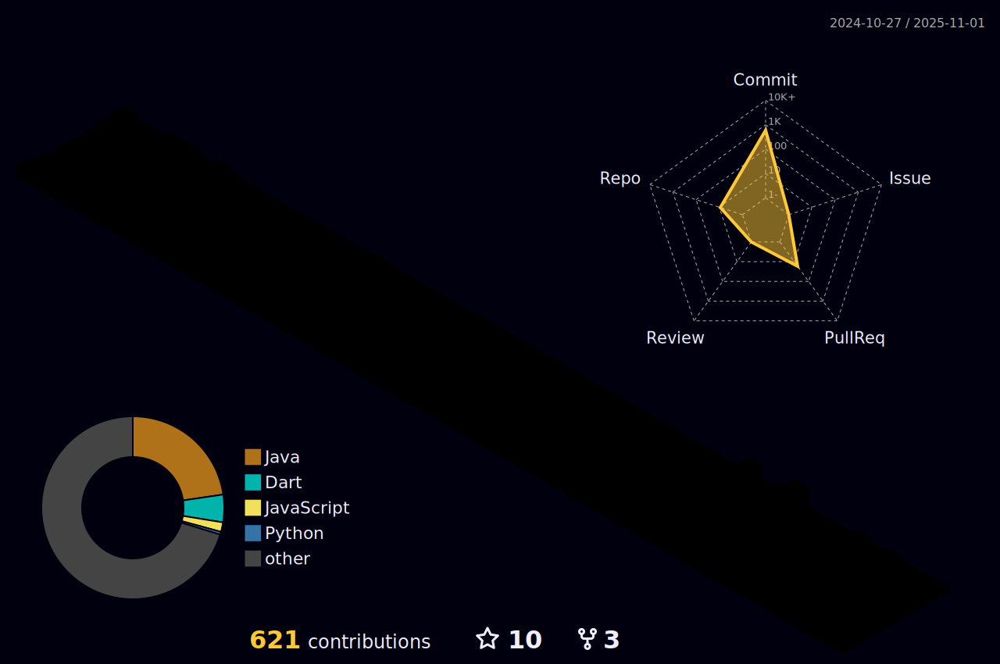

# Hola a todos ! 


</a> • 
<a href="https://github.com/iam-ravi-12?tab=followers"></a> • 
<a href="https://user-badge.committers.top/india_private/iam-ravi-12"></a> • 
 •
<a href ="https://metrics.lecoq.io/iam-ravi-12?template=classic&base.hireable=true&repositories.forks=true&isocalendar=1&languages=1&lines=1&stars=1&habits=1&followup=1&people=1&repositories=1&calendar=1&base=header%2C%20activity%2C%20community%2C%20repositories%2C%20metadata&base.indepth=false&base.hireable=true&base.skip=false&repositories.batch=100&repositories.forks=true&repositories.affiliations=owner&isocalendar=false&isocalendar.duration=full-year&languages=false&languages.limit=8&languages.threshold=0%25&languages.other=false&languages.colors=github&languages.sections=most-used&languages.indepth=false&languages.analysis.timeout=15&languages.categories=markup%2C%20programming&languages.recent.categories=markup%2C%20programming&languages.recent.load=300&languages.recent.days=14&lines=false&lines.sections=base&lines.repositories.limit=4&lines.history.limit=1&stars=false&stars.limit=4&habits=false&habits.from=200&habits.days=14&habits.facts=true&habits.charts=false&habits.charts.type=classic&habits.trim=false&habits.languages.limit=8&habits.languages.threshold=0%25&followup=false&followup.sections=repositories&followup.indepth=false&followup.archived=true&people=false&people.limit=24&people.identicons=false&people.identicons.hide=false&people.size=28&people.types=followers%2C%20following&people.shuffle=false&repositories=false&repositories.pinned=0&repositories.starred=0&repositories.random=0&repositories.order=featured%2C%20pinned%2C%20starred%2C%20random&calendar=false&calendar.limit=1&config.timezone=Asia%2FCalcutta">

</p>

```python
Name = "Ravi Ranjan Kumar"
Interests = ["Coding", "Cryptography", "Problem Solving", "Basketball", "Badminton","Exploring various OS :)"]
Languages = ["Java", "C++", "Python", "HTML", "CSS", "Flutter", "Dart", "React.js", "Javascript"]
OS = ["Ubuntu", "Windows", "Kali Linux", "Ubuntu Unity", "KUbuntu", "Arch"]
```
<!-- <div align=center>
  
[](https://github.com/iam-ravi-12)
</div> -->

  
### Wanna listen to what I am listening to ? :)  

<div align=center> 
  
  
[](https://spotify-github-profile.vercel.app/api/view?uid=31vw7gah4pkpssp3y4m2y2nk7yeq&redirect=true)
  
</div>

## 💻 My workspace


### Tech Stack:
<div align=left>  


<!--  -->


  


</div>


### Connect with me:
<div align=left>

<a href="https://www.linkedin.com/in/ravi-ranjan-kumar-569a72257/" alt="Ravi Ranjan Kumar | LinkedIn"></a> &nbsp;
<a href="https://www.instagram.com/iam_ravi_11/" alt="Kumar Ravi Singh | Instagram"></a> &nbsp;
<a href="mailto:raviranjan848484@gmail.com" alt="Ravi Ranjan Kumar | Gmail">
<a href="https://discordapp.com/users/ravi#3308" alt="Ravi Ranjan Kumar | Discord">
<!-- <a href="https://www.hackerrank.com/adityaseth_cse" alt="Aditya Seth | HackerRank"> -->
<!-- <a href="https://www.cloudskillsboost.google/public_profiles/b8eb9de8-382a-4ff8-9088-7ea496aac45d" alt="Aditya Seth | Google Cloud Skills"> -->
<!-- <a href="https://www.quora.com/profile/Aditya-Seth-133?ch=10&oid=1734427191&share=5335f444&srid=hzXNBO&target_type=user" alt="Aditya Seth | Quora"> -->

<a href="https://leetcode.com/iam_ravi_11/" alt="iam_ravi_11 | leetcode">
<a href="https://auth.geeksforgeeks.org/user/iam_ravi_11" alt="iam_ravi_11 | Quora"></div>

</div>
  
### Statistics :  
<div align="center">
   <a href="https://github.com/iam-ravi-12">
   
   </a>
   <a href="https://github.com/iam-ravi-12">
   
   <br/>
   </a>
</div>
 
<div align=center> 
<p></p>

</div>
  
  
<div align=center>            
   <a href="https://github.com/iam-ravi-12">
   " />
   
   </a>
</div>

[](https://holopin.io/@iamravi11)
  

  


<p align="left" style='margin: 8px 4px;'>
    
</p>
  
#
 [](https://quine.sh)
  [](https://quine.sh)
  [](https://quine.sh?utm_source=widgets&utm_campaign=iam-ravi-12)
  #
  
<p align="center">
    
  <h4 align="center"><code>📊 𝙶𝚒𝚝𝙷𝚞𝚋 𝙼𝚎𝚝𝚛𝚒𝚌𝚜</code></h4>
</p>

<p align="center">
  
</p>
  

#


<!-- [](https://github.com/iam-ravi-12) -->

<!-- <div align=center> -->
<!--    <a href="https://github.com/iam-ravi-12" target="_blank"> -->
<!--     -->
<!--    </a> -->
<!-- </div>   -->

<!-- [](https://github.com/iam-ravi-12/github-profile-trophy) -->
  
<!--   something to write -->
<!-- <a href="https://iam-ravi-12.github.io/raviranjankumar.github.io/"> -->
